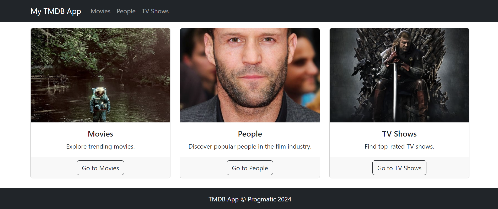

# React Router Gyakorlás

A cél egy dinamikus webalkalmazás létrehozása, amely blogbejegyzések megjelenítésére és részleteinek megtekintésére szolgál, mindezt a **React Router** segítségével. Az alkalmazásnak három fő útvonala lesz: egy **Főoldal**, ahol a felhasználók áttekinthetik a bejegyzések listáját; egy **Bejegyzés Részletező Oldal**, ahol az egyes bejegyzések tartalma és az azokhoz kapcsolódó hozzászólások láthatók; és egy **Névjegy oldal**, amely információkat nyújt az alkalmazásról és annak működéséről.

## Feladat lépései:

### 1. Főoldal

- **Cél**: A Főoldalon jelenjen meg a blogbejegyzések címeinek listája, amelyek a **JSONPlaceholder API**-ból lesznek lekérve.
- **Adatlekérés**: Használd a `fetch` könyvtárat az API hívásokhoz. A JSONPlaceholder API bejegyzéseit a következő URL-ről kérheted le: `https://jsonplaceholder.typicode.com/posts`.
  - Az API 100 különböző bejegyzést szolgáltat, mindegyik egyedi ID-val, címmel és tartalommal.
- **Adatmegjelenítés**: Az API-ból lekért bejegyzéseket egy `ul` vagy `ol` HTML listaelemen belül, dinamikusan jelenítsd meg. Minden bejegyzésnek csak a **címét** jelenítsd meg.
- **Navigáció**: Minden bejegyzés címe legyen kattintható. Amikor a felhasználó egy bejegyzés címére kattint, az adott bejegyzés ID-ja alapján irányítsd át a felhasználót a **Bejegyzés Részletező Oldalra**. Ehhez használd a `Link` komponenst a React Router-től.

### 2. Bejegyzés Részletező Oldal

- **Cél**: Az oldalon jelenjen meg a kiválasztott bejegyzés teljes szövege, valamint az ahhoz tartozó hozzászólások.
- **URL Paraméterek**: A bejegyzés ID-ja az URL-ből érkezik paraméterként, amit a `useParams` hook segítségével tudsz kinyerni. Példa URL: `/posts/1` ahol az "1" a bejegyzés ID-ja.
- **Adatlekérés**:
  - A kiválasztott bejegyzés részleteit a `https://jsonplaceholder.typicode.com/posts/{id}` végpontról kérd le, ahol az `id` az adott bejegyzés azonosítója.
  - A hozzászólásokat a `https://jsonplaceholder.typicode.com/posts/{id}/comments` végpontról tudod lekérni. Ezek az adatok egy tömbben érkeznek, és minden hozzászólás tartalmazza a szerző nevét, e-mail címét és a hozzászólás szövegét.
- **Adatmegjelenítés**:
  - A bejegyzés adatait (pl. cím, szöveg) egy külön divben vagy szekcióban jelenítsd meg.
  - A hozzászólásokat egy külön listában (`ul` vagy `ol`) mutasd, ahol minden egyes hozzászólás tartalmazza a szerző nevét, e-mail címét és magát a hozzászólást.

### 3. Névjegy Oldal

- **Cél**: Az alkalmazás Névjegy oldalának célja, hogy bemutassa a webalkalmazást, és rövid információt nyújtson arról, hogy mit tud az alkalmazás.
- **Használd a `useLocation` hookot**: Ezen az oldalon jelenítsd meg az aktuális URL-t a `useLocation` hook segítségével, amely információt ad a felhasználónak arról, hogy éppen melyik útvonalon tartózkodik.
- **Tartalom**: Az oldalon legyen egy rövid bemutatkozás az alkalmazásról, pl.: "Ez egy React Router példaprojekt, amely blogbejegyzések megjelenítését és részleteinek kezelését mutatja be."

## Követelmények és Best Practices

- **Routing**:
  - A navigáció kezeléséhez használd a `react-router-dom` csomagot. Állíts be három fő útvonalat:
    - `/` a Főoldal számára
    - `/posts/:id` a Bejegyzés Részletező Oldal számára
    - `/about` a Névjegy oldal számára
  - Használd a react-router-dom csomagból a createBrowserRouter és RouterProvider komponenseket.
  - Hozz létre egy createBrowserRouter-t, amely tartalmazza az útvonalakat, majd add át ezt a RouterProvider-nek, hogy az egész alkalmazás navigációs logikáját kezelni tudja.
- **Adatkezelés**: Minden adatot a **JSONPlaceholder API**-ból kérj le.
  - **Optimalizálás**: Az adatokat aszinkron API hívásokkal (`fetch`) töltsd be. Kezeld az esetleges hibaüzeneteket (pl. ha az API nem válaszol).
  - A bejegyzések és hozzászólások betöltését érdemes `useEffect` és `useState` hookok segítségével megoldani.
- **Interaktivitás**: Gondoskodj róla, hogy a felhasználó bármelyik bejegyzés címére kattintva gördülékenyen navigálhasson a részletező oldalra, majd onnan visszatérhessen a főoldalra.

## Kiegészítő Javaslatok

- **CSS**: Használj egyedi stílusokat a megjelenítéshez, hogy az alkalmazás látványos és felhasználóbarát legyen. Tervezz egy egyszerű, áttekinthető felületet.
- **Felhasználói élmény**: A navigáció legyen gyors és gördülékeny. Gondoskodj arról, hogy a bejegyzések és hozzászólások betöltése közben jelenjen meg egy töltésjelző (pl. egy "Loading..." szöveg).
- **Reszponzív design**: Gondoskodj arról, hogy az alkalmazás mobilon és asztali gépen is jól működjön.
- **Kódstruktúra**: Különítsd el a különböző komponenseket logikailag, hogy a kód könnyen karbantartható legyen. Használj újrafelhasználható komponenseket ott, ahol lehetséges (pl. hozzászólások listája).

 

 

## My TMDB App

A feladat részletes leírása: Az alkalmazás rendelkezik egy headerrel, amely menüpontokat tartalmaz a filmekhez, személyekhez és TV-műsorokhoz, és a tartalom dinamikusan változik a header és a footer közötti kimenetben. Egy home komponens jelenik meg alapvetően, amely tartalmaz három kártyát az említett három útvonal navigálásához. A filmek oldala felsorolja az összes film első oldalát, a személyek és a TV-műsorok oldalai ugyanezt teszik.

### TMDb API Regisztrációs Útmutató

#### 1. Fiók létrehozása a TMDb weboldalon

- Nyisd meg a [TMDb weboldalt](https://www.themoviedb.org/).
- Kattints a **Sign Up** (Regisztráció) gombra a jobb felső sarokban.
- Add meg az e-mail címedet, jelszavadat, és válaszd ki a felhasználónevedet.
- Fogadd el a felhasználási feltételeket, majd kattints a **Create Account** (Fiók létrehozása) gombra.

#### 2. Fiók megerősítése

- A regisztráció után kapsz egy megerősítő e-mailt. Kattints a megerősítő linkre az e-mailben, hogy aktiváld a fiókodat.

#### 3. API kulcs igénylése

- Miután bejelentkeztél, menj a [TMDb API oldalra](https://www.themoviedb.org/settings/api).
- Kattints a **Create** vagy **Request an API Key** gombra.
- Add meg a szükséges adatokat az űrlapon (projekt neve, felhasználási cél stb.).
- Kattints a **Submit** gombra, és jóváhagyás után megkapod az API kulcsodat.

#### 4. API kulcs használata

- Miután megszerezted az API kulcsot, használd a TMDb API endpointjaihoz való hozzáféréshez.
- Az API hívásokhoz az `api_key` paraméterrel kell hozzáadnod a kulcsodat.

---

Most már hozzáférhetsz a TMDb API-hoz, és elkezdheted a filmek, színészek és egyéb adatok lekérdezését a projektedhez.

### Az alábbi végpontokat használd:

1. Filmek listájának lekérése: https://api.themoviedb.org/3/trending/movie/day?api_key=YOUR_API_KEY&page=1

1. Személyek listájának lekérése: https://api.themoviedb.org/3/person/popular?api_key=YOUR_API_KEY&page=1

1. TV-műsorok listájának lekérése: https://api.themoviedb.org/3/trending/tv/day?api_key=YOUR_API_KEY&page=1

### Egyedi lekérdezések id alapján:

1. Filmek egyedi lekérése: https://api.themoviedb.org/3/movie/{movie_id}?api_key=YOUR_API_KEY

1. Személyek egyedi lekérése: https://api.themoviedb.org/3/person/{person_id}?api_key=YOUR_API_KEY

1. TV-műsorok egyedi lekérése: https://api.themoviedb.org/3/tv/{show_id}?api_key=YOUR_API_KEY

### Minden film, személy vagy TV-műsor kattintható és a részletes oldalra navigál, mint például:

1. Filmek: /movies/movie/:id
1. TV-műsorok: /tvshows/show/:id
1. Személyek: /people/:id

### A filmek, TV-műsorok és személyek képeinek megjelenítése:

A képek URL-címét a TMDB API válaszában található `poster_path` vagy `profile_path` adatok alapján tudjátok összeállítani, előtagként az https://image.tmdb.org/t/p/w500 címet használjátok.
Az alkalmazáshoz a matanult React Router DOM-ot használjátok, és opcionálisan a Bootstrapet is használhattok a dizájnhoz, de a végső dizájn nyugodtan változhat.

### Képek a javasolt megjelenítéshez:

