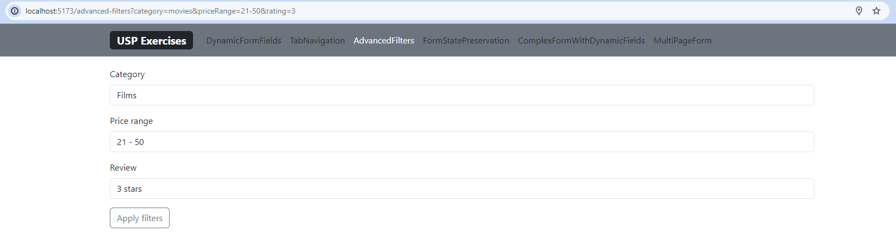

# UseSearchParams

## 1. Feladat: URL Search Params megjelenítése

Cél: Készíts egy React komponenst, amely dinamikusan jeleníti meg az aktuális URL keresési paramétereit.

### Feladat lépései:

1. Készíts egy SearchParamsDisplay nevű komponenst.
1. Használd a React Router useSearchParams hook-ját az aktuális URL keresési paramétereinek eléréséhez.
1. Jelenítsd meg minden keresési paramétert és azok értékeit egy listában.
1. Várt eredmény: Amikor a search-params-display útvonalra navigálsz URL keresési paraméterekkel (pl. ?param1=value1&param2=value2), a komponens rendereljen egy listát, amely minden paramétert és azok értékeit megjeleníti. Például, ha /search-params-display?param1=value1&param2=value2-re navigálsz, egy lista jelenik meg "param1: value1" és "param2: value2" elemekkel.

## 2. Feladat: Keresőmező

Cél: Készíts egy input mezőt, amely frissíti az URL keresési paramétereit a felhasználói bemenet alapján, a useSearchParams hook használatával az URL keresési paramétereinek olvasására és frissítésére.

### Feladat lépései:

1. Készíts egy SearchQueryInput nevű komponenst.
1. Renderelj egy szöveges input mezőt.
1. Használd a useSearchParams hookot az input mező értékének egy query nevű URL keresési paraméterhez kötésére.
1. Biztosítsd, hogy amikor a felhasználó gépel a bemeneti mezőbe, a query paraméter az URL-ben valós időben frissüljön, hogy tükrözze a bemeneti mező értékét.
1. Várt eredmény: A komponens megjelenít egy input mezőt, amely valós időben frissíti az URL keresési paramétereit a felhasználó bemenete alapján. Például, ha "Hello World"-öt gépelsz a bemeneti mezőbe, a böngésző URL-jében meg kell jelennie a ?query=Hello%20World paraméternek.

## 3. Feladat: Egylapos navigációs szűrő

Cél: Készíts egy navigációs szűrőt, amely frissíti a megjelenített tartalmat és az URL keresési paramétereit a felhasználó által kiválasztott kategória alapján.

### Feladat lépései:

1. Készíts egy NavigationFilter nevű komponenst.
1. Implementálj több gombot vagy linket, amelyek különböző kategóriákat képviselnek (pl. Könyvek, Filmek, Zene).
1. Használd a useSearchParams hookot az URL keresési paramétereinek frissítésére a kiválasztott kategória alapján.
1. Dinamikusan jelenítsd meg a kiválasztott kategória nevét az oldalon az aktuális URL keresési paramétereinek alapján.
1. Várt eredmény: A komponens betölt különböző gombokat vagy linkeket a kategóriákhoz, és dinamikusan frissíti a megjelenített tartalmat és az URL keresési paramétereit a kiválasztott gomb alapján.
1. Például, ha a "Filmek" gombra kattintasz, a megjelenített szöveg "Kiválasztott Kategória: Filmek" kell legyen, és a ?category=Filmek paramétert kell hozzáadnia az URL-hez.

## 4. Feladat: Szinkronizált input mezők

Cél: Készíts két az URL keresési paramétereivel szinkronizált input mezőt.

### Feladat lépései:

1. Hozz létre egy SynchronizedInputs nevű komponenst.
1. Jeleníts meg két szöveges bemeneti mezőt a.
1. Használd a useSearchParams hookot a bemeneti mezők értékeinek az URL keresési paramétereivel való összekötésére.
1. Biztosítsd, hogy az egyik mezőbe történő beíráskor a másik mező és az URL paraméterei ne vesszenek el.
1. Várt eredmény: A feladat során egy olyan komponenst kell készíts, ahol a két bemeneti mező értéke szinkronban van az URL-ben megadott paraméterekkel. Ha például az első mezőbe "teszt" szöveget írunk, az URL-nek és a második mezőbe írt értékeket továbbra is tartalmazni kell.

## 5. Feladat: Lapozás URL Search Params-szal

Célkitűzés: Implementálj egy listának a lapozását, ahol az aktuális oldalszám egy URL keresési paraméter által van szabályozva. Ez bemutatja, hogyan használhatók az URL paraméterek a navigációs vezérlésre egy lista vagy adatmegjelenítés esetében.

### Feladat lépései:

1. Hozz létre egy PaginationComponent nevű komponenst.
1. Jeleníts meg egy lapozó sávot.
1. Használd a useSearchParams hookot az oldalszám URL keresési paraméterként való kezelésére.
1. Az oldalszámváltásokat az URL paraméterek frissítésével valósítsd meg.
1. Várt eredmény: A gyakorlat eredményeként egy lapozható lista komponenst kell létrehozni, ahol az aktuális oldalszám az URL-ben van tárolva. Az oldalszám változtatásakor az URL frissülni fog az új oldalszámmal, ami lehetővé teszi a felhasználó számára, hogy közvetlen URL megadásával is navigáljon az oldalak között.

## 6. Feladat: Keresőszűrő több kritériummal

Célkitűzés: Készíts egy szűrőrendszert, amely lehetővé teszi a felhasználók számára az adatok szűrését több kritérium (pl. kategória, ártartomány) alapján az URL keresési paramétereivel. Ez a gyakorlat bemutatja az URL paraméterek fejlett használatát a szűréshez.

### Feladat lépései:

1. Hozz létre egy SearchFilters nevű komponenst.
1. Jeleníts meg több szűrő opciót tartalmazó űrlapot.
1. Használd a useSearchParams hookot a szűrők alkalmazásakor az URL keresési paramétereinek frissítésére az űrlapon beállított értékek alapján.
1. A kiválasztott szűrők alapján frissítsd az URL-t, hogy tükrözze a felhasználó által alkalmazott szűrési kritériumokat.
1. Várt eredmény: Egy olyan szűrőrendszert lértehozása, amely segítségével a felhasználók több szempont alapján szűrhetik az adatokat, és a kiválasztott szűrők az URL-ben lesznek reprezentálva.

## 7. Feladat: URL alapú dinamikus űrlapmezők

Cél: Készíts egy űrlapot, ahol az űrlapmezők dinamikusan jönnek létre az URL paraméterek alapján.

### Feladat lépései:

1. Hozz létre egy DynamicFormFields nevű komponenst.
1. Az űrlapmezők számát és típusát az URL paraméterek határozzák meg (pl. ?fields=text,number egy szöveges és egy számmezőt hoz létre).
1. Implementáld a logikát, ami az URL változásakor frissíti az űrlapmezőket.
1. Az űrlap adatok beküldésekor frissítsd az URL-t a megadott adatokkal.

## 8. Feladat: URL alapú tab navigáció

Cél: Implementálj egy fülek közötti navigációt, ahol az aktív fül az URL paraméterek segítségével legyen kezelve.

### Feladat lépései:

1. Hozz létre egy TabNavigation nevű komponenst.
1. A komponens tartalmazzon több fület (pl. Home, Profile, Messages).
1. Az aktív fül állapotát egy URL paraméter határozza meg (pl. ?tab=profile).
1. Az aktív fül váltásakor frissítsd az URL-t az új füllel.

## 9. Feladat: Többszörös URL alapú szűrő

Cél: Készíts egy összetett szűrőrendszert, amely több URL paramétert használ a szűréshez, például egy e-kereskedelmi terméklistán.

### Feladat lépései:

1. Hozz létre egy AdvancedFilters nevű komponenst.
1. Az űrlap lehetővé teszi több szűrési kritérium beállítását (pl. kategória, ár, értékelés).
1. A kiválasztott szűrők több URL paraméterben vannak tárolva.
1. A szűrők alkalmazásakor az alkalmazás frissítse dinamikusan a megjelenített termékek listáját az URL paraméterek alapján.

## 10. Feladat: URL paraméterek alapú űrlap állapotmegőrzéssel

Cél: Készíts egy űrlapot, amely az állapotát URL paraméterek segítségével menti és visszaállíthatja. Ez lehetővé teszi az űrlap állapotának megosztását vagy újratöltés utáni helyreállítását URL segítségével.

### Feladat lépései:

1. Hozz létre egy FormStatePreservation nevű komponenst.
1. Az űrlap több mezőből áll, mint például név, email, és hozzájárulás a hírlevélhez.
1. Az űrlap állapotát (kitöltött mezők értékei) URL paraméterekben tárold.
1. Az oldal újratöltésekor vagy megosztott URL használatával az űrlap állapotának vissza kell állnia az URL paraméterek alapján.

## 11. Feladat: Összetett űrlap dinamikus mezőkkel és URL paraméterekkel

Cél: Hozz létre egy összetett űrlapot, amely dinamikus mezőket tartalmaz, és az űrlap állapotát az URL paraméterekkel szinkronizálja, lehetővé téve a bonyolult űrlap állapotok megosztását URL-en keresztül.

### Feladat lépései:

1. Hozz létre egy ComplexFormWithDynamicFields nevű komponenst.
1. Az űrlap lehetővé teszi dinamikus mezők hozzáadását és eltávolítását (pl. több szerző hozzáadása egy publikációhoz).
1. Minden űrlapmező állapotát és a dinamikus mezők számát URL paraméterekkel kezeld.
1. Az űrlap állapotának URL segítségével történő megosztásakor a teljes űrlapkonfigurációnak kell megjelennie.

## 12. Feladat: URL alapú többoldalas űrlap

Cél: Készíts egy többoldalas űrlapot, amelynek navigációja és állapota URL paramétereken keresztül van kezelve, biztosítva az állapot megőrzését oldalak közötti navigáció során.

### Feladat lépései:

1. Hozz létre egy MultiPageForm nevű komponenst.
1. Az űrlap több lépésből álljon, például személyes adatok, szállítási cím és fizetési mód.
1. Minden lépéshez tartozik egy külön URL paraméter (pl. ?step=shipping).
1. Az űrlap állapota (pl. kitöltött mezők) menjen keresztül az egyes lépéseken, URL paraméterek segítségével.
